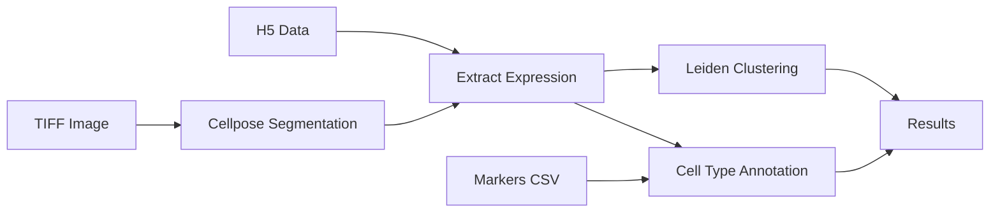

# AWS Spatial Transcriptomics Pipeline


Spatial transcriptomics analysis pipeline optimized for AWS HealthOmics using Wave containers from Seqera.

## 🚀 Quick Start

```bash
nextflow run main.nf \
  --tiff s3://your-bucket/inputs/sample.tif \
  --h5 s3://your-bucket/inputs/sample.h5 \
  --markers s3://your-bucket/inputs/markers.csv \
  --outdir s3://your-bucket/outputs \
  -profile awshealthomics
```

## 📦 Wave Container

This pipeline uses a pre-built Wave container with all required tools:

```
community.wave.seqera.io/library/cellpose_celltypist_imageio_leidenalg_pruned:a05017b20bc0977c
```

**Included tools:**
- **Cellpose** - Cell segmentation from microscopy images
- **CellTypist** - Automated cell type annotation
- **imageio** - Image I/O for TIFF processing
- **leidenalg** - Leiden clustering algorithm

## 📋 Pipeline Overview



**Workflow steps:**
1. **Cell Segmentation** - Cellpose identifies cells in microscopy images
2. **Expression Extraction** - Extract gene expression per segmented cell
3. **Clustering** - Leiden algorithm groups similar cells
4. **Annotation** - CellTypist assigns cell types based on markers

## 📂 Required Inputs

The pipeline requires **3 input files**:

| Input | Format | Description | Example |
|-------|--------|-------------|---------|
| `--tiff` | `.tif`, `.tiff` | Microscopy image | `s3://bucket/sample.tif` |
| `--h5` | `.h5`, `.h5ad` | Gene expression data | `s3://bucket/sample.h5` |
| `--markers` | `.csv` | Cell type markers | `s3://bucket/markers.csv` |

See [**S3_INPUT_FILES_GUIDE.md**](S3_INPUT_FILES_GUIDE.md) for detailed instructions on preparing these files.

## 🏃 Running the Pipeline

### On AWS HealthOmics

See [**AWS_HEALTHOMICS_SETUP.md**](AWS_HEALTHOMICS_SETUP.md) for complete setup instructions.

**Quick command:**
```bash
aws omics start-run \
  --workflow-id <workflow-id> \
  --role-arn <role-arn> \
  --parameters '{
    "tiff": "s3://bucket/inputs/sample.tif",
    "h5": "s3://bucket/inputs/sample.h5",
    "markers": "s3://bucket/inputs/markers.csv",
    "outdir": "s3://bucket/outputs"
  }'
```

### Locally with Docker

```bash
nextflow run main.nf \
  --tiff data/sample.tif \
  --h5 data/sample.h5 \
  --markers data/markers.csv \
  --outdir results \
  -profile docker
```

### On Seqera Platform

1. Add pipeline: `https://github.com/jackdon2896-bit/aws_spatial.git`
2. Select AWS Batch compute environment
3. Set parameters:
   - `tiff`: S3 path to image
   - `h5`: S3 path to expression data
   - `markers`: S3 path to markers CSV
   - `outdir`: S3 output directory
4. Launch!

## ⚙️ Parameters

### Required Parameters

```groovy
--tiff          Path to TIFF image file
--h5            Path to H5 expression data
--markers       Path to marker genes CSV
--outdir        Output directory
```

### Optional Parameters

```groovy
// Cellpose parameters
--cellpose_model              'cyto2' (default), 'nuclei', 'cyto'
--cellpose_diameter           30 (default)
--cellpose_flow_threshold     0.4 (default)
--cellpose_cellprob_threshold 0.0 (default)

// Clustering parameters
--cluster_resolution          1.0 (default)
--n_neighbors                 15 (default)
--n_pcs                       50 (default)
```

## 📊 Output Structure

```
outputs/
├── segmentation/
│   ├── segmentation_masks.npy      # Cell masks
│   ├── segmentation_flows.tif      # Cellpose flows
│   └── segmentation_stats.csv      # Segmentation statistics
├── expression/
│   ├── expression_matrix.csv       # Gene expression matrix
│   └── cell_metadata.csv           # Cell-level metadata
├── clustering/
│   ├── clusters.csv                # Cluster assignments
│   ├── umap_coordinates.csv        # UMAP coordinates
│   └── cluster_markers.csv         # Cluster markers
├── annotation/
│   ├── cell_types.csv              # Cell type predictions
│   └── annotation_scores.csv       # Confidence scores
└── reports/
    ├── timeline.html               # Execution timeline
    ├── report.html                 # Execution report
    ├── trace.txt                   # Resource usage
    └── dag.html                    # Pipeline DAG
```

## 🔧 Configuration Profiles

### `awshealthomics`
Optimized for AWS HealthOmics:
- AWS Batch executor
- Wave containers enabled
- Fusion for S3 optimization

### `docker`
For local testing:
- Docker executor
- Wave container

### `singularity`
For HPC environments:
- Singularity executor
- Wave container

## 📚 Documentation

- [**AWS_HEALTHOMICS_SETUP.md**](AWS_HEALTHOMICS_SETUP.md) - Complete AWS setup guide
- [**S3_INPUT_FILES_GUIDE.md**](S3_INPUT_FILES_GUIDE.md) - How to prepare 3 input files in S3

## 🛠️ Using the Container in ECR

To use the Wave container in AWS ECR:

```bash
# Pull Wave container
docker pull community.wave.seqera.io/library/cellpose_celltypist_imageio_leidenalg_pruned:a05017b20bc0977c

# Tag for ECR
docker tag \
  community.wave.seqera.io/library/cellpose_celltypist_imageio_leidenalg_pruned:a05017b20bc0977c \
  <account-id>.dkr.ecr.us-east-1.amazonaws.com/spatial-transcriptomics:v1.0.0

# Push to ECR
docker push <account-id>.dkr.ecr.us-east-1.amazonaws.com/spatial-transcriptomics:v1.0.0
```

Then update `nextflow.config`:
```groovy
process.container = '<account-id>.dkr.ecr.us-east-1.amazonaws.com/spatial-transcriptomics:v1.0.0'
```

## 💡 Example Workflows

### Basic Analysis
```bash
nextflow run main.nf \
  --tiff s3://bucket/visium_image.tif \
  --h5 s3://bucket/visium_data.h5 \
  --markers s3://bucket/brain_markers.csv \
  --outdir s3://bucket/results
```

### Custom Parameters
```bash
nextflow run main.nf \
  --tiff s3://bucket/image.tif \
  --h5 s3://bucket/data.h5 \
  --markers s3://bucket/markers.csv \
  --outdir s3://bucket/results \
  --cellpose_diameter 40 \
  --cluster_resolution 0.8 \
  --n_neighbors 20
```

## 🐛 Troubleshooting

### Common Issues

1. **Container pull errors**
   - Verify internet connectivity
   - Check Wave service status
   - Use ECR mirror (see setup guide)

2. **S3 access denied**
   - Verify IAM role permissions
   - Check bucket policy
   - Ensure files exist in specified paths

3. **Out of memory**
   - Increase process memory in config
   - Reduce image size
   - Use downsampled data for testing

### Get Help

- Check logs: `aws logs tail /aws/omics/workflow/<workflow-id>`
- View trace: `cat outputs/trace.txt`
- Pipeline DAG: Open `outputs/dag.html`

## 📖 Citations

If you use this pipeline, please cite:

- **Cellpose**: Stringer, C., et al. (2021). Cellpose: a generalist algorithm for cellular segmentation. *Nature Methods*, 18(1), 100-106.
- **Nextflow**: Di Tommaso, P., et al. (2017). Nextflow enables reproducible computational workflows. *Nature Biotechnology*, 35(4), 316-319.
- **Wave**: Seqera Labs. Wave Containers. https://seqera.io/wave/

## 📄 License

MIT License - See LICENSE file

## 🤝 Contributing

Contributions welcome! Please open an issue or pull request.

## 👤 Author

**jackdon2896-bit**
- GitHub: [@jackdon2896-bit](https://github.com/jackdon2896-bit)

## 🌟 Acknowledgments

- Seqera for Wave container service
- AWS for HealthOmics platform
- Cellpose, CellTypist, and leidenalg developers

---

**Ready to analyze spatial transcriptomics data on AWS! 🧬🚀**
